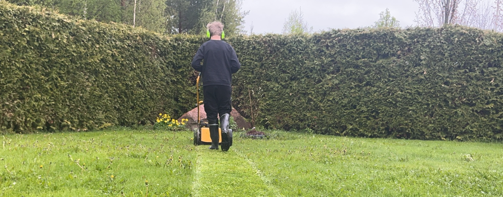
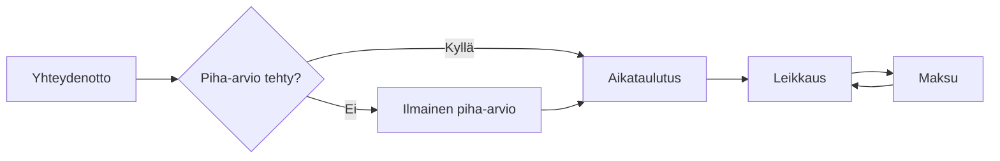

# Vaivaton ja Edullinen Ruohonleikkuupalvelu Muuramessa

* Kaipaatko nurmikollesi edullista ja vaivatonta leikkauspalvelua.
* Haluatko auttaa reipasta ja omatoimista yläasteelaista tienaamaan moporahoja?

!!! tip "Näin Pääset Alkuun"

    [:material-form-select: Tilaa vaivaton ja ilmainen piha-arvio](https://forms.gle/Tnt9ebGAe1aDXwMVA){ .md-button }

    TAI

    [:material-phone: 050 361 2198](tel:+358503612198){ .md-button }

    TAI

    [:octicons-mail-24: ruohonleikkuu@roikonen.fi](mailto:ruohonleikkuu@roikonen.fi?subject=Piha-arvio&body=Muuramen%20katuosoitteesi%20sekä%20puhelinnumerosi){ .md-button }

## Hinnoittelu

Pihasi hinnoittelu hoidetaan noin 10 minuutin mittaisen ilmaisen arviointikäynnin yhteydessä. Siinä pihasi arvioidaan silmämääräisesti koon ja monimutkaisuuden mukaan T-paita-kokoihin. Piha-arvio ei velvoita tilaamaan.

| Koko & monimutkaisuus | Hinta/leikkauskerta |
| --------------------- | ------------------- |
| S | 10€ |
| M | 15€ |
| L | 20€ |

_Ei ALV-velvollinen (alle 1000 € liikevaihto vuodessa)_

Jos asiakkaalta ei löydy omaa ruohonleikkuria tai bensaa, veloitamme lisäksi kalustomaksun, joka tuplaa leikkuun hinnan.

??? info "Esimerkki: Asiakkaalla on oma leikkuri ja bensat"

    Piha-arviossa pihasi arvioidaan kokoon M. Sinulta löytyy ruohonleikkuri ja siihen bensat, joten yhden leikkuukerran hinnaksi muodostuu 15€.

??? info "Esimerkki: Asiakkaalla ei ole leikkuria"

    Piha-arviossa pihasi arvioidaan kokoon S. Sinulta ei löydy ruohonleikkuria, joten yhden leikkuukerran hinnaksi muodostuu 20€ (10€ * 2).

## Palveluehdot

1. Asiakas vastaa tarjoamansa leikkuuvälineistön ruohonleikkuri kunnosta ja turvallisuudesta, niin ettei se aiheuta palvelun tarjoajalle vaaraa.
1. Asiakkaan tulee perehdyttää palvelun suorittaja työvälineiden asianmukaiseen käyttöön.
1. Palvelu sisältää ruohonleikkuun moottorikäyttöisellä ruohonleikkurilla. Ruohotrimmerin käyttö ei kuulu palveluun.
1. Palvelun suorittaa yläaste-ikäinen henkilö, joten työn jälki voi jättää toivomisen varaa. Jos jälki ei miellytä, edeltävän leikkuukerran rahat saa takaisin. Lisäksi työn jäljestä voi jättää palautetta ja näin seuraavalla kerralla työn laatu toivottavasti paranee.
1. Palvelun tarjoaja tai suorittaja ei vastaa asiakkaan tarjoaman leikkuuvälineistön (kuten ruohonleikkuri) kunnosta, eikä ole korvausvelvollinen asiakkaan omaisuuteen syntyvistä vaurioista.
1. Palvelut veloitetaan asiakkaalta työn jälkeen.
1. Työ tehdään ennalta sovittuina arkipäivinä aikavälillä 9-17.

## Palaute

[Anna palautetta](https://forms.gle/erpWD5qhEBahiwnV7)
